# AI Ad Generator 🚀

AI Ad Generator is a simple React + Node.js app that creates Instagram ad copy from business details. It returns a short ad text, a CTA, and at least three hashtags in the selected language.

## ✨ Features

- 🧠 AI-powered Instagram ad generation
- 📝 Business name and product/service inputs
- 🌍 Language selector for English, Russian, and Azerbaijani
- 🎯 Audience, goal, and tone controls
- 📣 Short ad text, CTA, and hashtag output
- 🔁 Demo fallback mode when no API key is configured
- 🎨 Animated demo-mode SVG asset for README preview
- 📱 Responsive interface

## 🧰 Tech Stack

- ⚛️ Frontend: React + Vite
- 🟩 Backend: Node.js + Express
- 🤖 AI providers: OpenAI, Claude, and Gemini

## 📁 Project Structure

```text
.
├── public
│   └── demo-mode.svg
├── server
│   ├── controllers
│   │   └── adsController.js
│   ├── services
│   │   └── aiService.js
│   ├── app.js
│   ├── .env
│   └── package.json
└── src
    ├── components
    │   ├── AdForm.jsx
    │   └── AdResult.jsx
    ├── App.jsx
    └── App.css
```

## ⚙️ Environment Variables

Configure the backend locally in `server/.env`.

```env
PORT=5000
AI_PROVIDER=openai

OPENAI_API_KEY=
OPENAI_MODEL=gpt-4.1-mini

CLAUDE_API_KEY=
CLAUDE_MODEL=claude-3-5-haiku-latest

GEMINI_API_KEY=
GEMINI_MODEL=gemini-3.5-flash
```

Set `AI_PROVIDER` to one of:

- `openai`
- `claude`
- `gemini`

If no API key is provided, the app still works in demo mode.

## ▶️ Run Locally

Install frontend dependencies:

```bash
npm install
```

Install backend dependencies:

```bash
npm --prefix server install
```

Start the React app:

```bash
npm run dev
```

Start the Node server in a second terminal:

```bash
npm run dev:server
```

Open the app:

```text
http://localhost:5173
```

## 🔌 API

Generate an ad:

```http
POST /api/ads/generate
```

Request body:

```json
{
  "businessName": "Cafe Baku",
  "audience": "young professionals",
  "language": "english",
  "goal": "awareness",
  "tone": "friendly",
  "productInfo": "Fresh breakfast and specialty coffee near offices."
}
```

Supported `language` values:

- `english`
- `russian`
- `azerbaijani`

Response:

```json
{
  "ad": {
    "shortAdText": "Cafe Baku helps young professionals increase brand awareness...",
    "callToAction": "Order now",
    "isDemoMode": true,
    "hashtags": ["#InstagramAd", "#BusinessGrowth", "#LimitedOffer"]
  }
}
```

## ✅ Checks

Run lint:

```bash
npm run lint
```

Build the frontend:

```bash
npm run build
```

## 🖼️ Demo SVG

The animated demo-mode graphic lives at:

```text
public/demo-mode.svg
```

It is a README/demo asset and is not rendered inside the app UI.
